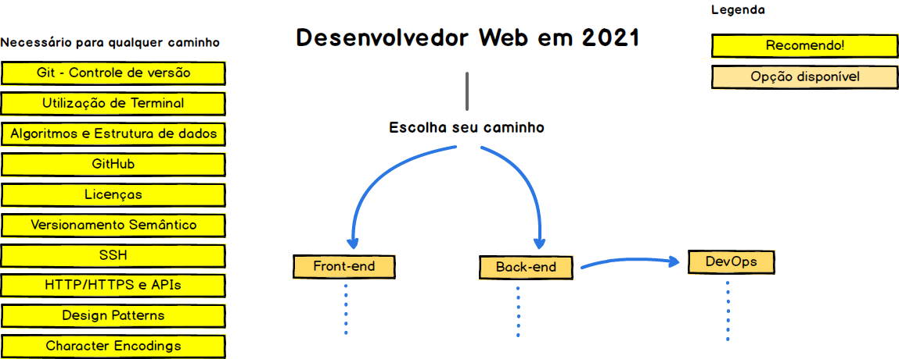
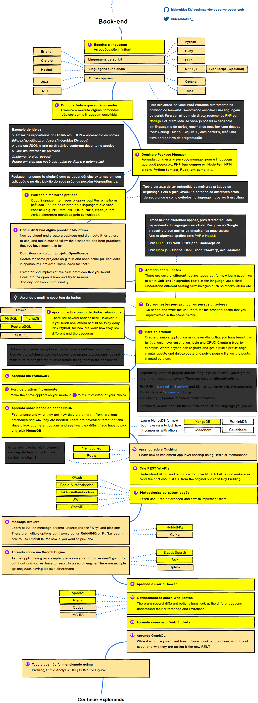

 </b>

  
  <h2 align="center">Roadmap do Desenvolvedor Web</h2>
  
Roadmap para se tornar um Desenvolvedor Web em 2019

  

    
    
  

   

Abaixo você encontra, de forma visual, os caminhos que você pode tomar e tecnologias que pode adotar para se tornar um profissional de frontend, backend e devops. 

Diga "Oi"   
.

## Aviso
> A proposta deste roadmap é dar uma ideia sobre o atual panorama e guiá-lo se você estiver confuso sobre qual o próximo aprendizado, não influenciar você a seguir os 'hypes' e 'trendys' do momento. Acreditamos que com um <b>maior conhecimento das diferentes estruturas e soluções disponíveis poderá escolher a ferramenta que melhor se aplica às duas demandas.</b> E lembre-se, 'hypes' e 'trendys' nem sempre são as melhores opções. 

## Introdução

## Frontend Roadmap

## Back-end Roadmap

## DevOps Roadmap

## 🚦 Fique ligado

Se você acredita que os roadmaps podem ser incrementados, por favor abra um <i>Pull Request</i> com a atualização e submeta as <i>Issues</i> para discussão. De qualquer forma, continuarei atualizando os readmaps sempre que necessário, então clique em watch/star e fique ligado neste repositório. 

## 🙌 Colabore

> Dê uma olhada no [colaborando.md](./colaborando.md) para saber como atualizar qualquer um dos roadmaps

- Abra <i>Pull Requests</i> com atualizações
- Discuta ideias em <i>Issues</i>
- Compartilhe o repositório com a sua comunidade
- Mande feedbacks no [Twitter](https://twitter.com/hideraldoluis_)

## Licença

  
Originalmente criado por [kamranahmedse](https://twitter.com/kamranahmedse)  
Produção original disponível em [developer-roadmap](https://github.com/kamranahmedse/developer-roadmap)  
Traduzido e adaptado por [hideraldoluis_](https://twitter.com/hideraldoluis_) e [LuysHNS](https://twitter.com/LuysHNS)
